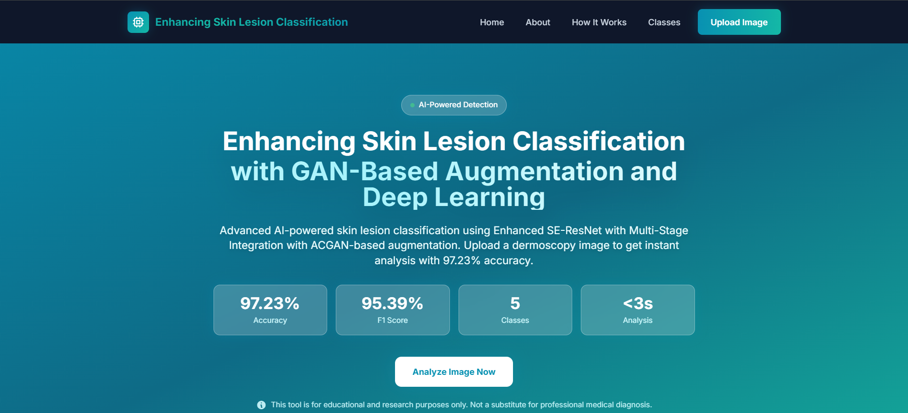
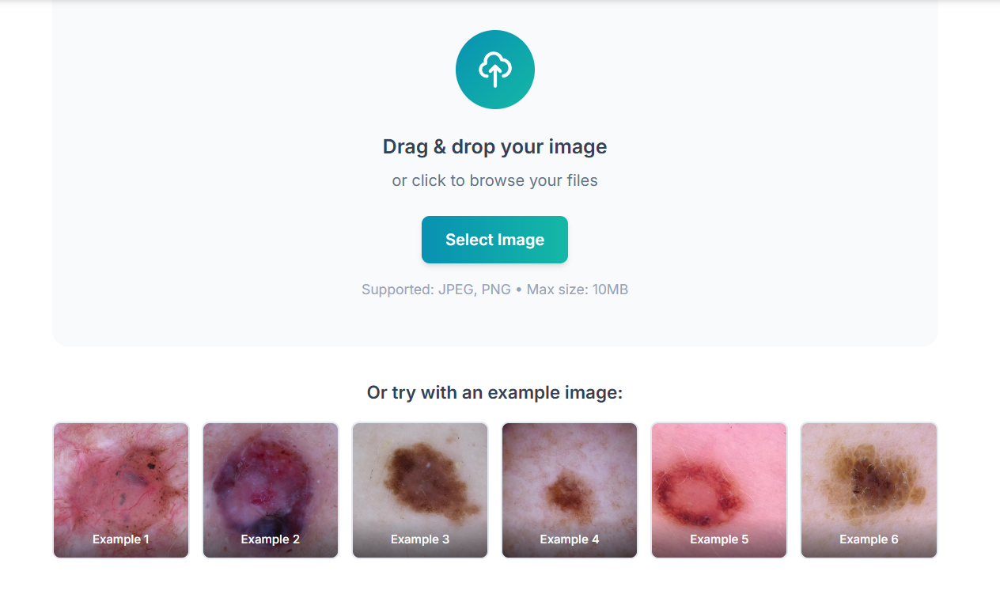
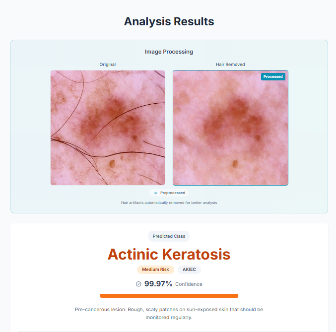
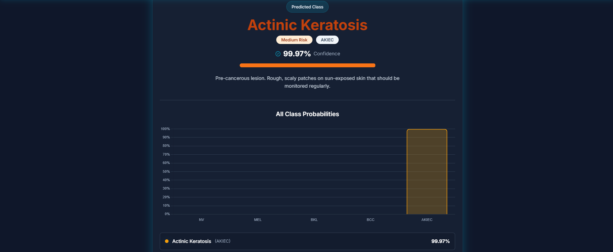

# 🔬 Enhancing Skin Lesion Classification with GAN-Based Augmentation and Deep Learning

> Advanced AI-powered skin lesion classification system using Enhanced SE-ResNet with multi-stage integration and ACGAN-based augmentation

[](https://www.python.org/)
[](https://fastapi.tiangolo.com/)
[](https://reactjs.org/)
[](https://pytorch.org/)
[](LICENSE)

An intelligent full-stack web application that leverages Enhanced SE-ResNet architecture with ACGAN-based data augmentation to classify skin lesions into 5 categories with **97.23% accuracy**.



---

## 📋 Table of Contents

- [Key Features](#-key-features)
- [Model Innovation](#-model-innovation)
- [Performance Metrics](#-performance-metrics)
- [Tech Stack](#-tech-stack)
- [Prerequisites](#-prerequisites)
- [Installation](#-installation)
- [Running the Application](#-running-the-application)
- [Project Structure](#-project-structure)
- [API Documentation](#-api-documentation)
- [Usage Guide](#-usage-guide)
- [Model Architecture](#-model-architecture)
- [Screenshots](#-screenshots)
- [Troubleshooting](#-troubleshooting)
- [Contributing](#-contributing)
- [License](#-license)
- [Disclaimer](#%EF%B8%8F-disclaimer)

---

## ✨ Key Features

### 🎯 **Model & AI**
- 🧠 **Enhanced SE-ResNet**: Multi-stage SE blocks with residual connections across Layer 1-4
- 🎨 **ACGAN Augmentation**: Class-conditional generation targeting minority classes (MEL, AKIEC)
- 🔬 **Advanced Preprocessing**: Black-hat transform + inpainting for hair artifact removal
- 📊 **97.23% Accuracy**: State-of-the-art performance on HAM10000 dataset
- ⚡ **Fast Inference**: <3 seconds analysis time

### 🎨 **User Interface**
- 🌙 **Dark Theme**: Modern glassmorphism design with glow effects
- 📱 **Fully Responsive**: Optimized for desktop, tablet, and mobile
- 🖼️ **Drag & Drop Upload**: Intuitive image upload interface
- 📈 **Interactive Visualizations**: Chart.js powered probability charts
- 🔄 **Before/After Comparison**: Hair removal process visualization
- ✨ **Smooth Animations**: 300ms transitions with gradient effects

### 🛠️ **Technical**
- 🚀 **Modern Stack**: React 19 + FastAPI + PyTorch 2.9
- 🎯 **Type Safety**: Pydantic schemas + Python type hints
- 🔒 **Secure**: File validation, size limits, CORS configuration
- 📖 **Auto Documentation**: Swagger UI + ReDoc
- 🎭 **Singleton Pattern**: Efficient model loading
- 🌐 **RESTful API**: Clean endpoint design

---

## 🧬 Model Innovation

### **Enhanced SE-ResNet Architecture**

Unlike standard SE-ResNet which adds a single SE block after the final layer, our Enhanced SE-ResNet features:

#### **Multi-Stage Integration**
- ✅ SE blocks integrated across **all 4 ResNet layers** (not just Layer 4)
- ✅ Channel attention mechanism at each stage
- ✅ Better feature recalibration throughout the network

#### **Residual SE Connections**
- ✅ Novel residual connections **after each SE block**
- ✅ Preserves original feature representation while adding attention
- ✅ Improved gradient flow and training stability

#### **GAN-Based Data Augmentation**
- ✅ **ACGAN** (Auxiliary Classifier GAN): Class-conditional generation for minority classes
- ✅ **DCGAN**: General synthetic image generation
- ✅ Addresses extreme class imbalance in HAM10000 dataset
- ✅ Targets Melanoma (MEL) and Actinic Keratosis (AKIEC)

```
Standard SE-ResNet:          Enhanced SE-ResNet:
Layer 1 ────→ features      Layer 1 ──→ SE ──┐
Layer 2 ────→ features      Layer 2 ──→ SE ──┼→ Residual Add
Layer 3 ────→ features      Layer 3 ──→ SE ──┤
Layer 4 ──→ SE ──→ output   Layer 4 ──→ SE ──┘──→ output
```

---

## 🎯 Performance Metrics

Our Enhanced SE-ResNet + ACGAN combination achieves state-of-the-art results:

| Metric | Score | Improvement Over Base |
|--------|-------|----------------------|
| **Accuracy** | **97.23%** | +30.23% vs Base ResNet |
| **F1 Score (Macro)** | **95.39%** | +38.39% vs Base ResNet |
| **Precision (Macro)** | **95.83%** | +42.83% vs Base ResNet |
| **Recall (Macro)** | **94.99%** | +37.99% vs Base ResNet |

### **Classified Skin Lesions:**

| Class | Full Name | Type | Risk Level |
|-------|-----------|------|------------|
| **NV** | Melanocytic Nevi | Benign moles | 🟢 Low |
| **MEL** | Melanoma | Malignant cancer | 🔴 High |
| **BKL** | Benign Keratosis | Benign lesion | 🟢 Low |
| **BCC** | Basal Cell Carcinoma | Common cancer | 🟡 Medium |
| **AKIEC** | Actinic Keratosis | Pre-cancerous | 🟡 Medium |

### **Model Evolution:**

```
Base ResNet50:              67.00% accuracy
+ DCGAN augmentation:       91.00% accuracy  
+ ACGAN augmentation:       79.00% accuracy
SE-ResNet + ACGAN:          96.10% accuracy
Enhanced SE-ResNet + ACGAN: 97.23% accuracy ⭐
```

---

## 🛠️ Tech Stack

### **Backend**
- **Framework:** FastAPI 0.104.1 (async, high performance)
- **ML Framework:** PyTorch 2.9.1 + torchvision 0.24.1
- **Image Processing:** OpenCV 4.8.1, Pillow 11.3.0
- **Server:** Uvicorn (ASGI server)
- **Validation:** Pydantic 2.5.0

### **Frontend**
- **UI Library:** React 19.2.0 (latest)
- **Build Tool:** Vite 7.2.4
- **Styling:** Tailwind CSS 3.4.1 (custom dark theme)
- **Visualization:** Chart.js 4.5.1 + react-chartjs-2 5.3.1
- **HTTP Client:** Axios 1.13.2
- **Fonts:** Inter (Google Fonts)

### **ML Model**
- **Architecture:** Enhanced SE-ResNet50
- **Base Model:** ResNet-50 (pretrained on ImageNet)
- **SE Blocks:** Multi-stage (Layer 1-4) with residual connections
- **Input Size:** 224×224 RGB
- **Parameters:** 25.2M trainable parameters
- **Augmentation:** ACGAN-based class-conditional generation

### **Development Tools**
- **Version Control:** Git
- **Package Managers:** pip (Python), npm (Node.js)
- **API Documentation:** Swagger UI, ReDoc (auto-generated)

---

## 📦 Prerequisites

### **Required Software**

1. **Python 3.11+**
   ```bash
   python --version  # Should be 3.11 or higher
   ```
   Download: [python.org](https://www.python.org/downloads/)

2. **Node.js 18+ and npm**
   ```bash
   node --version  # Should be 18 or higher
   npm --version
   ```
   Download: [nodejs.org](https://nodejs.org/)

3. **Git** (optional, for cloning)
   ```bash
   git --version
   ```
   Download: [git-scm.com](https://git-scm.com/)

### **System Requirements**

| Component | Minimum | Recommended |
|-----------|---------|-------------|
| **RAM** | 4 GB | 8 GB |
| **Storage** | 500 MB free | 1 GB free |
| **GPU** | Not required | CUDA-compatible (optional) |
| **Display** | 1280×720 | 1920×1080 |

---

## 🚀 Installation

### **Step 1: Clone or Download**

```bash
# Option A: Clone with Git
git clone https://github.com/yourusername/skin-cancer-detection-ai.git
cd skin-cancer-detection-ai

# Option B: Download ZIP and extract
```

### **Step 2: Backend Setup**

```bash
cd backend

# Create virtual environment (recommended)
python -m venv venv

# Activate virtual environment
# Windows:
venv\Scripts\activate
# macOS/Linux:
source venv/bin/activate

# Install dependencies
pip install -r requirements.txt

# Verify model file exists
# backend/models/SEResnet_model.pth should be present (97MB)
```

### **Step 3: Frontend Setup**

```bash
cd frontend

# Install dependencies
npm install

# This installs React, Vite, Tailwind CSS, Chart.js, Axios, etc.
```

---

## 🏃 Running the Application

You need **two terminal windows** running simultaneously.

### **Terminal 1: Backend Server**

```bash
cd backend

# Activate virtual environment if not already active
# Windows: venv\Scripts\activate
# macOS/Linux: source venv/bin/activate

# Start FastAPI server
python -m uvicorn app.main:app --reload --port 8000
```

**Backend URLs:**
- 🌐 API: http://localhost:8000
- 📖 Swagger UI: http://localhost:8000/docs
- 📚 ReDoc: http://localhost:8000/redoc

**Expected Output:**
```
INFO:     Uvicorn running on http://127.0.0.1:8000
Using device: cpu (or cuda if GPU available)
[OK] Model loaded successfully!
INFO:     Application startup complete.
```

### **Terminal 2: Frontend Server**

```bash
cd frontend

# Start Vite development server
npm run dev
```

**Frontend URL:**
- 🎨 Application: http://localhost:5173

**Expected Output:**
```
  VITE v7.2.4  ready in XXX ms

  ➜  Local:   http://localhost:5173/
  ➜  Network: use --host to expose
```

### **Step 3: Open Browser**

Navigate to **http://localhost:5173** and start analyzing images! 🎉

---

## 📁 Project Structure

```
skin-cancer-detection/
│
├── backend/                          # Python FastAPI Backend
│   ├── app/
│   │   ├── __init__.py
│   │   ├── main.py                  # FastAPI application entry point
│   │   ├── api/
│   │   │   ├── __init__.py
│   │   │   └── routes.py            # API endpoint definitions
│   │   ├── core/
│   │   │   ├── __init__.py
│   │   │   ├── config.py            # Application configuration
│   │   │   └── model_loader.py      # Singleton model loader
│   │   ├── models/
│   │   │   ├── __init__.py
│   │   │   └── model_definition.py  # Enhanced SE-ResNet architecture
│   │   ├── schemas/
│   │   │   ├── __init__.py
│   │   │   └── response.py          # Pydantic response models
│   │   ├── services/
│   │   │   ├── __init__.py
│   │   │   └── inference.py         # Prediction logic
│   │   └── utils/
│   │       ├── __init__.py
│   │       ├── hair_removal.py      # Black-hat transform & inpainting
│   │       └── image_utils.py       # Image preprocessing utilities
│   ├── models/
│   │   └── SEResnet_model.pth       # Trained model weights (97MB)
│   ├── requirements.txt             # Python dependencies
│   └── README.md                    # Backend documentation
│
├── frontend/                         # React Vite Frontend
│   ├── public/
│   │   └── examples/                # 6 example dermoscopy images
│   │       ├── example1.jpg
│   │       ├── example2.jpeg
│   │       ├── example3.jpeg
│   │       ├── example4.jpeg
│   │       ├── example5.jpeg
│   │       └── example6.jpeg
│   ├── src/
│   │   ├── components/              # React components
│   │   │   ├── AboutSection.jsx     # Project information
│   │   │   ├── ClassesInfoSection.jsx # Lesion classes info
│   │   │   ├── ExampleImages.jsx    # Example image grid
│   │   │   ├── HeroSection.jsx      # Landing hero section
│   │   │   ├── HowItWorksSection.jsx # Methodology explanation
│   │   │   ├── ImageProcessingPreview.jsx # Before/after comparison
│   │   │   ├── LoadingSpinner.jsx   # Multi-stage loading indicator
│   │   │   ├── Navbar.jsx           # Navigation bar
│   │   │   ├── PredictionChart.jsx  # Chart.js bar chart
│   │   │   ├── ResultsSection.jsx   # Results display
│   │   │   └── UploadSection.jsx    # Drag & drop upload
│   │   ├── services/
│   │   │   └── api.js               # Axios API client
│   │   ├── utils/
│   │   │   └── constants.js         # App constants & configs
│   │   ├── App.jsx                  # Main app component
│   │   ├── main.jsx                 # React entry point
│   │   └── index.css                # Global styles + Tailwind
│   ├── package.json                 # Node dependencies
│   ├── tailwind.config.js           # Tailwind configuration (dark theme)
│   ├── vite.config.js               # Vite configuration
│   └── README.md                    # Frontend documentation
│
├── docs/
│   └── screenshots/                 # UI screenshots
│       ├── home.png
│       ├── upload.png
│       ├── results.png
│       └── results2.png
│
├── LICENSE                          # MIT License + Medical Disclaimer
├── README.md                        # This file
└── QUICKSTART.md                    # Quick setup guide (Turkish)
```

---

## 📡 API Documentation

### **Base URL:** `http://localhost:8000/api`

### **Endpoints:**

#### **1. Health Check**
```http
GET /api/health
```
Check if API and model are loaded properly.

**Response:**
```json
{
  "status": "ok",
  "model_loaded": true,
  "message": "API is running and model is loaded"
}
```

---

#### **2. Model Information**
```http
GET /api/model-info
```
Get model architecture and performance metrics.

**Response:**
```json
{
  "model_name": "Enhanced SE-ResNet",
  "num_classes": 5,
  "input_size": [224, 224],
  "accuracy": 0.9723,
  "f1_score": 0.9539,
  "precision": 0.9583,
  "recall": 0.9499
}
```

---

#### **3. Classes Information**
```http
GET /api/classes
```
Get information about all 5 skin lesion classes.

**Response:**
```json
{
  "classes": [
    {
      "index": 0,
      "name": "NV",
      "full_name": "Melanocytic Nevi",
      "description": "Benign moles. Common skin lesions that are usually harmless.",
      "risk_level": "Low"
    },
    ...
  ]
}
```

---

#### **4. Predict**
```http
POST /api/predict
Content-Type: multipart/form-data

Body:
  file: <image_file> (JPEG/PNG, max 10MB)
```
Upload an image and get prediction results.

**Example Response:**
```json
{
  "predicted_class": "MEL",
  "predicted_class_index": 1,
  "confidence": 0.9523,
  "probabilities": {
    "NV": 0.0234,
    "MEL": 0.9523,
    "BKL": 0.0123,
    "BCC": 0.0089,
    "AKIEC": 0.0031
  },
  "processing": {
    "hair_removed": true,
    "processed_image": "data:image/jpeg;base64,/9j/4AAQSkZJRgABAQ..."
  },
  "model_info": {
    "accuracy": 0.9723,
    "f1_score": 0.9539
  }
}
```

### **Interactive API Documentation**

Visit these URLs when the backend is running:
- **Swagger UI:** http://localhost:8000/docs (try endpoints interactively)
- **ReDoc:** http://localhost:8000/redoc (alternative documentation)

---

## 🎮 Usage Guide

### **1. Upload an Image**

#### **Option A: Drag & Drop**
- Drag a dermoscopy image from your file explorer
- Drop it into the upload area on the website

#### **Option B: Browse Files**
- Click the **"Select Image"** button
- Choose a JPEG or PNG image (max 10MB)

#### **Option C: Use Example Images**
- Scroll below the upload area
- Click any of the 6 example images

### **2. Analyze**

Click the **"Analyze Image"** button to start AI analysis.

**What Happens:**
1. 🔄 **Preparing** - Image is loaded and validated
2. 💇 **Removing Hair** - Black-hat transform isolates and removes hair artifacts
3. 🧠 **Analyzing** - Enhanced SE-ResNet processes the image
4. ✅ **Complete** - Results are displayed

### **3. View Results**

The application displays:
- 🎯 **Predicted Class** - The most likely lesion type
- 📊 **Confidence Score** - Model's certainty (0-100%)
- 📈 **Probability Chart** - Bar chart showing all class probabilities
- 🖼️ **Before/After** - Original vs processed image comparison
- 💡 **Class Information** - Description and risk level

### **4. Learn More**

Scroll down to explore:
- **About Section** - Project details and technology
- **How It Works** - Step-by-step analysis pipeline
- **Classes Info** - Detailed information about each lesion type with medical recommendations

### **5. Analyze Another**

Click **"Analyze Another Image"** to clear results and upload a new image.

---

## 🏗️ Model Architecture

### **Enhanced SE-ResNet Detailed Breakdown**

```python
# Pseudo-code structure
class EnhancedSEResNet(nn.Module):
    def __init__(self):
        self.resnet_base = ResNet50(pretrained=True)
        
        # Multi-stage SE blocks (our innovation)
        self.se_layer1 = SEModule(channels=256)
        self.se_layer2 = SEModule(channels=512)
        self.se_layer3 = SEModule(channels=1024)
        self.se_layer4 = SEModule(channels=2048)
        
        # Custom classifier
        self.classifier = nn.Sequential(
            nn.Linear(2048, 512),
            nn.BatchNorm1d(512),
            nn.ReLU(),
            nn.Dropout(0.5),
            nn.Linear(512, 5)  # 5 classes
        )
    
    def forward(self, x):
        x = self.resnet_base.initial_layers(x)
        
        # Layer 1 + SE + Residual
        x = self.resnet_base.layer1(x)
        identity = x
        x = self.se_layer1(x) + identity  # Residual connection
        
        # Layer 2 + SE + Residual
        x = self.resnet_base.layer2(x)
        identity = x
        x = self.se_layer2(x) + identity
        
        # Layer 3 + SE + Residual
        x = self.resnet_base.layer3(x)
        identity = x
        x = self.se_layer3(x) + identity
        
        # Layer 4 + SE + Residual
        x = self.resnet_base.layer4(x)
        identity = x
        x = self.se_layer4(x) + identity
        
        # Classifier
        x = self.resnet_base.avgpool(x)
        x = torch.flatten(x, 1)
        x = self.classifier(x)
        
        return x
```

### **Squeeze-and-Excitation (SE) Block**

```python
class SEModule(nn.Module):
    def __init__(self, channels, reduction=16):
        self.avg_pool = nn.AdaptiveAvgPool2d(1)
        self.fc = nn.Sequential(
            nn.Linear(channels, channels // reduction),
            nn.ReLU(inplace=True),
            nn.Linear(channels // reduction, channels),
            nn.Sigmoid()
        )
    
    def forward(self, x):
        # Squeeze: Global pooling
        b, c, _, _ = x.size()
        y = self.avg_pool(x).view(b, c)
        
        # Excitation: FC layers with sigmoid
        y = self.fc(y).view(b, c, 1, 1)
        
        # Scale: Channel-wise multiplication
        return x * y
```

### **Training Pipeline**

```
1. Data Loading
   └─ HAM10000 dataset (10,015 images)

2. Preprocessing
   ├─ Hair Removal (black-hat + inpainting)
   └─ Resize to 224×224

3. Data Augmentation
   ├─ ACGAN: Generate minority class samples
   │   ├─ Melanoma (MEL)
   │   └─ Actinic Keratosis (AKIEC)
   └─ Standard augmentation
       ├─ Random horizontal flip
       ├─ Random rotation (±20°)
       ├─ Color jitter
       └─ Normalization (ImageNet stats)

4. Training
   ├─ Optimizer: Adam (lr=0.0001)
   ├─ Loss: CrossEntropyLoss with class weighting
   ├─ Epochs: 150
   ├─ Batch size: 32
   └─ Early stopping (patience=10)

5. Evaluation
   └─ Test set: 20% holdout
```

---

## 📸 Screenshots

### **Dark Theme Home Page**


### **Upload Interface**


### **Hair Removal Comparison**


### **Prediction Results**


---

## 🔧 Troubleshooting

### **Backend Issues**

#### ❌ **Problem: "Module not found" error**
```bash
# Solution: Reinstall dependencies
cd backend
pip install -r requirements.txt
```

#### ❌ **Problem: "Model file not found"**
```bash
# Solution: Verify model file exists
# Windows:
dir backend\models\SEResnet_model.pth
# Linux/Mac:
ls backend/models/SEResnet_model.pth

# File should be ~97MB
```

#### ❌ **Problem: Port 8000 already in use**
```bash
# Solution A: Use different port
uvicorn app.main:app --reload --port 8001
# Then update frontend/src/services/api.js API_BASE_URL

# Solution B: Kill process on port 8000 (Windows)
netstat -ano | findstr :8000
taskkill /PID <PID> /F

# Solution B: Kill process on port 8000 (Linux/Mac)
lsof -ti:8000 | xargs kill -9
```

#### ❌ **Problem: CORS errors in browser**
```bash
# Solution: Ensure backend is running on port 8000
# Frontend expects: http://localhost:8000
# Check browser console for exact error
```

---

### **Frontend Issues**

#### ❌ **Problem: "npm command not found"**
```bash
# Solution: Install Node.js from nodejs.org
# Verify installation:
node --version
npm --version
```

#### ❌ **Problem: Tailwind CSS not working**
```bash
# Solution: Clean reinstall
cd frontend
rm -rf node_modules package-lock.json
npm install
npm run dev
```

#### ❌ **Problem: Port 5173 already in use**
```bash
# Solution: Vite will automatically use next available port
# Check terminal output for actual port number
# Example: "http://localhost:5174"
```

#### ❌ **Problem: "Network Error" when analyzing**
```bash
# Solution: Verify backend is running
# 1. Check http://localhost:8000/docs is accessible
# 2. Check browser console for exact error
# 3. Ensure no firewall blocking port 8000
```

---

### **General Issues**

#### ❌ **Problem: Slow predictions (>5 seconds)**
- **Reason:** Running on CPU (normal behavior)
- **Solution:** 
  - GPU will be faster but CPU works fine (~2-3 seconds)
  - First prediction may be slower due to model loading
  - Subsequent predictions will be faster

#### ❌ **Problem: Out of memory error**
- **Solution:**
  - Close other applications
  - Minimum 4GB RAM required
  - If using GPU, ensure sufficient VRAM (2GB+)

#### ❌ **Problem: Model loading fails**
```bash
# Check Python version
python --version  # Should be 3.11+

# Reinstall PyTorch
pip uninstall torch torchvision
pip install torch==2.9.1 torchvision==0.24.1 --index-url https://download.pytorch.org/whl/cpu
```

---

## 🧪 Testing

### **Quick Test (with Example Images)**

1. Start both backend and frontend servers
2. Navigate to http://localhost:5173
3. Click on any example image below the upload area
4. Click "Analyze Image"
5. Wait 2-3 seconds for results
6. Verify you see:
   - ✅ Predicted class name
   - ✅ Confidence percentage
   - ✅ Bar chart with probabilities
   - ✅ Before/after hair removal comparison

### **API Testing (with curl)**

```bash
# Health check
curl http://localhost:8000/api/health

# Model info
curl http://localhost:8000/api/model-info

# Prediction (replace with actual image path)
curl -X POST "http://localhost:8000/api/predict" \
  -H "accept: application/json" \
  -H "Content-Type: multipart/form-data" \
  -F "file=@path/to/your/image.jpg"
```

### **API Testing (with Swagger UI)**

1. Open http://localhost:8000/docs
2. Click on **POST /api/predict**
3. Click **"Try it out"**
4. Click **"Choose File"** and select an image
5. Click **"Execute"**
6. View JSON response below

---

## 🤝 Contributing

Contributions are welcome! This project is developed as an educational tool, and we appreciate improvements.

### **How to Contribute:**

1. **Fork** the repository
2. **Create** a feature branch
   ```bash
   git checkout -b feature/AmazingFeature
   ```
3. **Commit** your changes
   ```bash
   git commit -m 'Add some AmazingFeature'
   ```
4. **Push** to the branch
   ```bash
   git push origin feature/AmazingFeature
   ```
5. **Open** a Pull Request

### **Contribution Guidelines:**

- Follow existing code style
- Add comments for complex logic
- Update README if adding new features
- Test thoroughly before submitting PR
- Include screenshots for UI changes

---

## 📝 License

This project is licensed under the **MIT License** - see the [LICENSE](LICENSE) file for details.

### **MIT License Summary:**
- ✅ Commercial use allowed
- ✅ Modification allowed
- ✅ Distribution allowed
- ✅ Private use allowed
- ⚠️ Liability limitation
- ⚠️ No warranty

---

## ⚠️ Disclaimer

### **IMPORTANT: Medical Disclaimer**

**This application is for EDUCATIONAL and RESEARCH purposes ONLY.**

🚫 **This is NOT a medical device**
🚫 **Do NOT use for actual medical diagnosis**
🚫 **Do NOT use as a substitute for professional medical advice**

### **Legal Notice:**

- This software is an **educational and research project**
- It is intended to demonstrate the application of deep learning in medical image analysis
- **Always consult qualified healthcare professionals** for any skin concerns
- Early detection and professional medical evaluation are **crucial** for skin cancer treatment
- The developers assume **NO responsibility** for any medical decisions made based on this application

### **If you have skin concerns:**

1. 📞 **Consult a dermatologist immediately**
2. 🏥 **Schedule regular skin examinations**
3. ☀️ **Use sun protection** (SPF 30+ sunscreen)
4. 👀 **Monitor for changes** in size, shape, color, or symptoms
5. 📸 **Document any suspicious lesions** for your doctor

---

## 👥 Authors & Acknowledgments

### **Development Team**

| Role | Name | Responsibilities | Contact |
|------|------|------------------|---------|
| 💻 **Software Engineer** | **Ertuğrul Bayraktar** | Full-stack development, web application, deployment, UI/UX design | [GitHub](https://github.com/ertugrulbayraktr) |
| 🤖 **Artificial Intelligence Engineer** | **Ahmet Furkan Öztürk** | Enhanced SE-ResNet architecture, ACGAN/DCGAN implementation, model training | [GitHub](https://github.com/Furkan-21) |

**Project Supervisor:** Assoc. Prof. Dr. Nazım Kemal ÜRE

**🔬 Detailed Model Research & Training Repository:**  
For in-depth information about the Enhanced SE-ResNet architecture, GAN training process, and experimental results, visit:  
[Enhanced-SE-ResNet-ACGAN-Lesion-Classification](https://github.com/Furkan-21/Enhanced-SE-ResNet-ACGAN-Lesion-Classification)

### **Acknowledgments**

- 📊 **HAM10000 Dataset** - Harvard Dataverse
  - Tschandl, P., Rosendahl, C. & Kittler, H. The HAM10000 dataset
- 📚 **Research Papers:**
  - ResNet: [Deep Residual Learning for Image Recognition](https://arxiv.org/abs/1512.03385)
  - SENet: [Squeeze-and-Excitation Networks](https://arxiv.org/abs/1709.01507)
  - ACGAN: [Conditional Image Synthesis With Auxiliary Classifier GANs](https://arxiv.org/abs/1610.09585)
- 🛠️ **Open Source Technologies:**
  - PyTorch Team
  - FastAPI Team
  - React Team
  - Tailwind CSS Team
  - Chart.js Contributors

### **Special Thanks**

- Medical AI research community for inspiration
- Open-source community for excellent tools and frameworks
- Academic research community for valuable datasets and papers

---

## 📚 References

### **Academic Papers**

1. **ResNet**
   - He, K., Zhang, X., Ren, S., & Sun, J. (2016). Deep Residual Learning for Image Recognition. CVPR.
   - [https://arxiv.org/abs/1512.03385](https://arxiv.org/abs/1512.03385)

2. **Squeeze-and-Excitation Networks**
   - Hu, J., Shen, L., & Sun, G. (2018). Squeeze-and-Excitation Networks. CVPR.
   - [https://arxiv.org/abs/1709.01507](https://arxiv.org/abs/1709.01507)

3. **ACGAN**
   - Odena, A., Olah, C., & Shlens, J. (2017). Conditional Image Synthesis With Auxiliary Classifier GANs. ICML.
   - [https://arxiv.org/abs/1610.09585](https://arxiv.org/abs/1610.09585)

4. **HAM10000 Dataset**
   - Tschandl, P., Rosendahl, C. & Kittler, H. (2018). The HAM10000 dataset, a large collection of multi-source dermatoscopic images of common pigmented skin lesions.
   - [https://dataverse.harvard.edu/dataset.xhtml?persistentId=doi:10.7910/DVN/DBW86T](https://dataverse.harvard.edu/dataset.xhtml?persistentId=doi:10.7910/DVN/DBW86T)

### **Documentation**

- **FastAPI:** [https://fastapi.tiangolo.com/](https://fastapi.tiangolo.com/)
- **PyTorch:** [https://pytorch.org/docs/](https://pytorch.org/docs/)
- **React:** [https://react.dev/](https://react.dev/)
- **Tailwind CSS:** [https://tailwindcss.com/docs](https://tailwindcss.com/docs)

---

## 🔗 Links

- 📦 **Repository:** [GitHub - Skin Cancer Detection AI](https://github.com/yourusername/skin-cancer-detection-ai)
- 📖 **Documentation:** [Full Documentation](https://github.com/yourusername/skin-cancer-detection-ai/wiki)
- 🐛 **Issues:** [Report a Bug](https://github.com/yourusername/skin-cancer-detection-ai/issues)
- 💡 **Feature Requests:** [Request a Feature](https://github.com/yourusername/skin-cancer-detection-ai/issues/new)

---

## 📊 Project Status

- ✅ **Backend:** Complete and stable
- ✅ **Frontend:** Complete and stable
- ✅ **Model:** Trained and deployed
- ✅ **Documentation:** Complete
- ✅ **Testing:** Functional testing complete
- 🔄 **Future Work:** See [Issues](https://github.com/yourusername/skin-cancer-detection-ai/issues)

### **Version History**

- **v1.0.0** (Current) - Initial release
  - Enhanced SE-ResNet implementation
  - ACGAN-based augmentation
  - Dark theme UI
  - Complete documentation

---

## 💻 Quick Start Commands

```bash
# Clone repository
git clone https://github.com/yourusername/skin-cancer-detection-ai.git
cd skin-cancer-detection-ai

# Backend setup
cd backend
python -m venv venv
venv\Scripts\activate  # Windows
pip install -r requirements.txt
python -m uvicorn app.main:app --reload --port 8000

# Frontend setup (new terminal)
cd frontend
npm install
npm run dev

# Access application
# Frontend: http://localhost:5173
# Backend API: http://localhost:8000
# API Docs: http://localhost:8000/docs
```

---

<div align="center">

**⭐ Star this repository if you find it helpful!**

**Made with ❤️ for Education & Research**

**© 2024 Skin Cancer Detection Project**

[⬆ Back to Top](#-enhancing-skin-lesion-classification-with-gan-based-augmentation-and-deep-learning)

</div>
